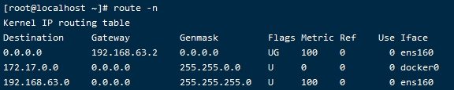
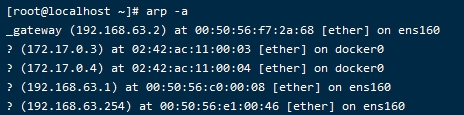

# 网络模型
> OSI模型
> - 应用层（application layer）  #http、https、ftp、telnet、ssh、smtp、pop3
> - 表示层（presentation layer）  #把数据转换为能与接收者的系统格式兼容并适合传输的格式
> - 会话层（session layer） #负责在数据传输中设置和维护计算机网络中两台计算机之间的通信连接
> - 传输层（transport layer） #把传输表头（TH）加至数据以形成数据包。传输表头包含了所使用的协议等发送信息。传输控制协议：tcp，udp
> - 网络层（network layer） #决定数据的路径选择和转寄，将网络表头（NH）加至数据包，以形成分组。网络表头包含了网络数据。互联网协议：ip
> - 链路层（data link layer）  #负责网络寻址、错误侦测和改错。当表头和表尾被加至数据包时，会形成帧。以太网（ethernet），无限局域网（WIFI）和通用分组无限服务（GPRS）
>   - 数据链表头（DLH）包含了物理地址和错误侦测以及改错的方法。
>   - 数据链表尾（DLT）是一串指示数据包末端的字符串。
> - 物理层 （physical layer）  #在局部局域网上传送数据帧（data frame），负责管理计算机通信设备和网络媒体之间的互通。包括了针脚，电压，线缆规范，集线器，中继器，网卡，主机适配器。

# showtime
> ```
>     cd /proc/$$/fd  #进去当前进程的文件描述符目录
>     exec 8<> /dev/tcp/www.baidu.com/80  #创建文件描述符8，并且输入输出指向磁盘目录
>     ll  #可见8文件描述符指向socket，可知已经过三次握手建立连接
>     echo -e 'GET / HTTP/1.0\n' >& 8  #将'GET / HTTP/1.0输出到文件描述符8，其中字符串是http协议中规定的最小请求头
>     cat 0<& 8  #输出文件描述符8的内容，执行可见获取了百度页面内容
> ```
> 1. 建立连接
> 2. 传输数据（http协议：规范标准）
> 
> - 应用层 （用户态）
>   - 数据格式化
> - 传输层 （内核态）
>   - netstat -natp（传输层表）
>   - 创建数据包
>   - socket把协议抽象出统一的接口，建立socket连接能建立三次握手
> - 网络层 （内核态）
>   - route -n（网络层表）
> - 链路层 （内核态）
>   - arp -a（链路层表）
> - 物理层 （内核态）

# 应用层
> ## HTTP协议：【data】

# 传输层
> ## TCP协议：【【TCP】【data】】
> - 一种面向连接的、可靠的、基于字节流的传输层通信协议
> - 三次握手 -> 数据传输 -> 四次分手
>   - 最小粒度，不可分割：假想：一个client，多个server负载均衡，第一次握手打在server1，第三次握手却打在server2，大问题！！
> - 连接断开并不是物理上断开了，连接断开本质上是资源的释放
>   - 如何建立连接 => 三次握手
>       - 为何是三次：本质上双方确认是否【能够】通信（输入输出）成功
>           1. 发送方发送，接收方接收：
>           2. 接收方发送，发送方接收：发送方输入成功，发送方输出成功
>           3. 发送方发送，接收方接收：接收方输入成功，接收方输出成功
>       - 三次握手完成后，双方才通知应用层占用资源，开启线程
>   - 如何断开连接 => 四次分手
>       - 为何需要四次分手
>           1. 资源有限，不能无限增长资源
>           2. 连接断开，需要双方确认，以确保数据已经传输完毕
>       - 为何是四次：本质上双方确认是【同意】断开通信
>           1. 发送方发送，接收方接收：
>           2. 接收方发送，发送方接收：发送方断开信息发送成功（发送方知道对方已收到要断开的通知）
>           3. 接收方发送，发送方接收：发送方确认可以断开连接（发送方知道对方同意断开连接）
>           4. 发送方发送，接收方接收：接收方确认可以断开连接（接收方知道对方同意断开连接）
>   - 如何确认可靠
>       - 三次握手和四次分手
>       - 数据发送后，会收到确认
>   - 偷懒的tcp（tcp的优化，可能导致三次握手和数据传输界限不明确）
>       - 在第三次握手的时候，会带着数据一并发送
>       - 在数据传输的时候，确认包会带着数据一并发送（就是不断地确认，确认，确认...）

# 网络层
> ## IP协议：【【IP】【TCP】【data】】
> ```
>   cat /etc/sysconfig/network-scripts/ifconfig-XXX
>       TYPE=Ethernet  #以太网
>       IPADDR  #IP地址
>       NETMASK  #子网掩码，与IPADDR作位与运算，得到网络号
>       GATEWAY  #网关
>       DNS  #domain name system，域名系统，域名解析，解析域名与IP的映射（全网的）
> ```
> - 网络层任务：找到目标地址，方案：
>   1. 所有机器自己记录所有地址的数据，数据海量，速度过慢
>   2. IP协议：下一跳机制：只记录某个范围内数据 => 通过路由找到下一个范围内数据。。。（被抨击，存在丢包问题，可经过试验没问题）
> - IP协议  
>   ```ping www.baidu.com```
>   1. 通过DNS获取目标IP
>   2. 通过目标IP，与Genmask（子网掩码）作位与运算，再与Destination（网络号）匹配，获得最终Gateway（网关）  
>   
>       - 当匹配到Gateway为0.0.0.0时，可以直接跟目标地址通信。当匹配到的Gateway非0.0.0.0时，需要跳到下个路由。
>       - Genmask为0.0.0.0的是默认网关，一般是路由器地址
> - PS：从某台设备出发，经过一个个路由，汇集到运营商ISP（电信、移动等）管理的路由（运营商会有一个网络管理队伍，制定好详细的路由规则），经过这个路由后，就能正确地跳到其他路由。  
>   需要人工配置
>   ```
>       route add -host [ip]          gw    [ip]
>                 主机  主机ip         网关  网关ip
>       route add -net  [ip/num]      gw    [ip]
>                 网络  网络ip/掩码位数 网关  网关ip
>   ```

# 链路层
> ## ARP协议：解析IP与网卡硬件地址的映射（局域网）：【【ARP】【IP】【TCP】【data】】
>   
> 通过网关地址，转换为网卡硬件地址，向下层传递
> - ARP（address resolution protocol）原理
>   1. 当需要发送请求时，会查看ARP缓存，如果找到映射直接使用
>   2. 若找不到映射，将会向本地网络广播ARP请求（当前MAC地址+源IP+下一跳MAC地址（FFFFFFFF）+目标IP）  
>   3. 本地网络上每台机器接收到ARP请求并验证是否与ARP请求匹配，如果不匹配，直接丢弃
>   4. 如果某台机器匹配，将ARP数据缓存起来，并且直接回复ARP请求。
>   5. 源主机收到ARP回复后，将ARP数据缓存起来，然后使用
>   6. 因此ARP协议是建立在本地网络互相信任的基础上的，不需要人工配置
> - 实质上只有计算机的网卡激活，会主动通告本地网络自己的信息（主动广播ARP请求）
> - 交换机会学习记录ARP请求，缓存ARP信息
>

# 光与电
> 光速在无介质情况下传输最快
> 光缆中会减速，不过稳定，带宽高，适合长距离传输
> 电缆比光缆快，不过信号衰减得快，带宽没光缆高

# 负载均衡产生原因
> - 单个应用容器无法承载大量请求，需要扩充多个应用容器来分担请求
> - 基于网络工程原则，多个服务器建立连接时，无法共享一个IP，故需要一个中间件来承接转发
> - 单个中间件为何能承载大量请求：足够快
>   - 应用容器慢原因：1、处于应用层，经过的层数最多，2、应用层有个用户态和内核态的切换（某些应用容器一般还在操作系统上还建立了自己的虚拟机，还需要虚拟机内存与内核内存的拷贝）
>   - 中间件实现猜想：1、用户态和内核态的切换，不够快，至少来到传输层，2、建立握手时间，不够快，至少来到网络层，3、网络层，能直接转发数据包（满足请求转发需要），可能就比网线慢，应该够快了
> - 中间件处于网络层存在问题
>   1. 不知道数据内容，所以中间件无法感知要转发给谁，要达到发给谁都一样（服务器对中间件来说是一致的、镜像的）
>
> - 7层负载与4层负载区别
>   - 7层是为了业务转发，需要达到应用层知道数据内容，所以7层负载后面对接的可以是不一样的服务
>   - 4层是为了流量转发，需要达到网络层知道ip，所以4层负载后面对接的是一样的服务
> 
> - 使用中间件问题
>    - 客户端直接请求到4层负载的ip地址，所以请求数据包的目标IP是4层负载的地址，就算4层负载把请求数据包转发了，数据包的目标IP不是真实处理的服务器IP，真实服务器会把请求丢弃

# NAT
> 